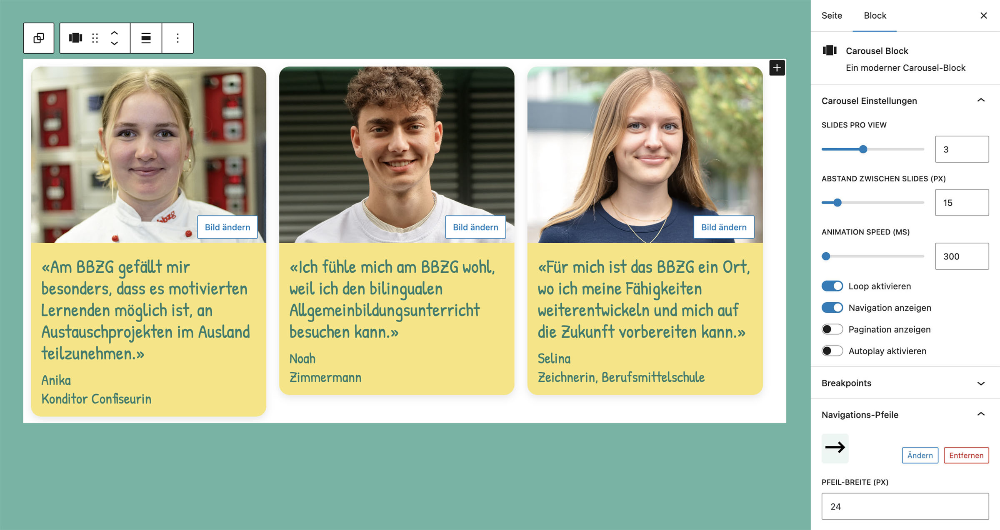

# UD Block: Carousel

Carousel-Block für den WordPress-Block-Editor auf Basis von **Swiper.js**.
Er ermöglicht flexible, responsive Slider mit Navigation, Pagination und optionalem Autoplay.

## Funktionen
- Responsive Carousel mit Swiper.js
- Unterstützt Navigation, Pagination, Autoplay und Loop
- Anpassbare Slide-Anzahl, Geschwindigkeit, Abstände und Farben
- Eigene Navigationspfeile wählbar (Upload oder Medienauswahl)
- Responsive Breakpoints direkt im Editor konfigurierbar
- Innerer Block: `ud/slide-block` für einzelne Slides
- Getrennte Editor- und Frontend-Skripte
- Kompatibel mit Full Site Editing (FSE)

## Screenshots

*Frontend-Ansicht.*

*Editor-Ansicht.*

## Autor

[ulrich.digital gmbh](https://ulrich.digital)

## Lizenz

GPL v2 or later
[https://www.gnu.org/licenses/gpl-2.0.html](https://www.gnu.org/licenses/gpl-2.0.html)

<!--
Interne Verwendung:
Eingesetzt im Projekt bbzg.ch
-->
